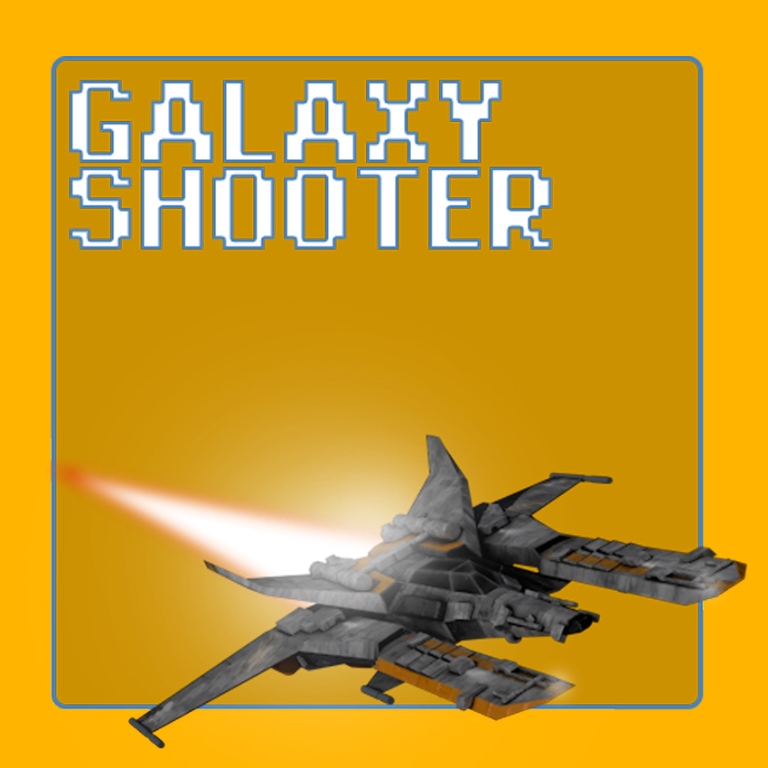
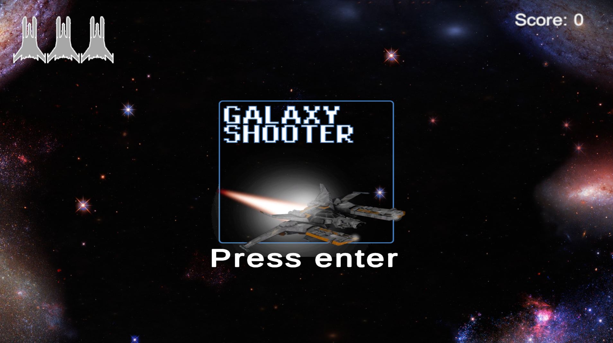
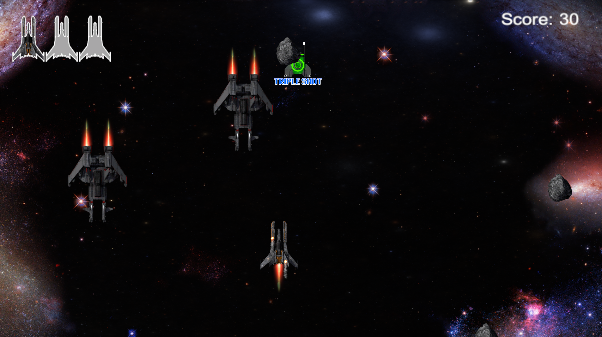

# Galaxy Shooter



**Galaxy Shooter** thrusts you into a relentless 2D shoot 'em up adventure crafted with Unity. Dodge enemy fire and unleash triple lasers, speed boosts, and shields to survive. No levels, just endless waves—destroy as many foes as you can with three lives. Victory depends on your skill and reflexes.

## Credits

This project was developed based on the knowledge acquired through courses and educational materials provided by [Udemy](https://www.udemy.com/course/o-guia-definitivo-para-desenvolvimento-de-jogos-com-unity/learn/lecture/8369870#overview).

We would like to thank the Rockseat team for providing valuable educational resources that contributed to the development of this project.

For more information about the courses and materials offered by Jonathan Weinberger and João Kucera, please visit the official website at [Udemy](https://www.udemy.com/course/o-guia-definitivo-para-desenvolvimento-de-jogos-com-unity/learn/lecture/8369870#overview).

## Technology

The following are the key technologies and tools used in the development of this app:

- **Unity**: Is a popular game development platform used to create both 2D and 3D games, interactive applications, simulations, and more. It provides a comprehensive set of tools for game design, animation development, physics, graphic rendering, audio, and more. With Unity, developers can create multiplatform games for desktop, mobile, web, and consoles. It supports multiple programming languages, including C#, JavaScript, and Boo, but C# is the most commonly used scripting language by Unity developers.
- **C#**: Is an object-oriented programming language developed by Microsoft. It's widely used for building applications, including games, due to its clean syntax, strong typing, automatic memory management, and extensive standard library.

## Key Features

- **Intense Shooting Action**: Dive into endless 2D space combat against relentless waves of enemy ships.
- **Dynamic Power-Ups**: Unleash devastating triple lasers, turbocharge your speed, or fortify your defenses with shields, all randomly.
- **Endless Challenge**: No levels, no stages - just survive as long as possible against endless waves of adversaries.
- **Tactical Gameplay**: Quickly adapt to the randomly appearing power-ups to maximize your effectiveness amidst chaos.
- **Three Lives to Conquer the Cosmos**: With only three lives at your disposal, every moment is crucial in your quest for galactic supremacy.

## How to Play

- **Controls**: Use the right mouse button to fire your lasers. Use the WASD keys to navigate your spacecraft through the cosmic battleground.
- **Pause**: Press the "ESC" key to pause the game at any time. Take a breather, assess the situation, and jump back into action when ready.
- **Restart on Defeat**: If your spacecraft meets its demise, fear not. The game automatically restarts, giving you another chance to dominate the cosmos.
- **Scoring System**: Rack up points with each enemy ship you obliterate. Keep track of your score as you strive to outdo your previous achievements.
- **Watch out for Asteroids**: Beware of asteroids drifting through space. Colliding with them will deplete your life count. However, you can destroy them using your laser firepower and survival.

## Screenshots

### Menu



### In-Game



## Installation

To run the app locally, follow these steps:

1. Clone the repository:

   ```bash
   git clone https://github.com/edsoncamargo/galaxy-shooter-unity
   cd your-path/galaxy-shooter-unity
   ```

2. Open the Project in Unity:

   - Open Unity Hub.
   - Click on "Open" and navigate to the directory where the repository was cloned.
   - Select the Unity project folder and click "Select Folder" to open the project in the Unity Editor.

3. Set Up the Build:

   - In the Unity Editor, go to "File" > "Build Settings."
   - Make sure all necessary scenes are included in the build.
   - Select the target platform for the build (e.g., PC, Mac, Android, iOS).

4. Run the Project:
   - After setting up the build settings, click the "Play" button in the top corner of the Unity Editor to run the project.
   - Wait for Unity to compile and run the project. The game will open in the Unity Editor's Game view.

## Contribution

You are welcome to contribute to the development of this project. If you find bugs, wish to add new features, or improve usability, feel free to open an issue or submit a pull request.

## Contact

- Name: Edson Camargo Menezes
- Email: contact@edsoncamargo.dev

## Acknowledgments

Special thanks to everyone who contributed to making this game a reality, especially my course intrutors.

Enjoy using **Galaxy Shooter!**
